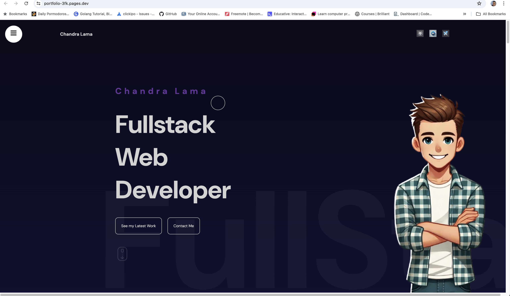
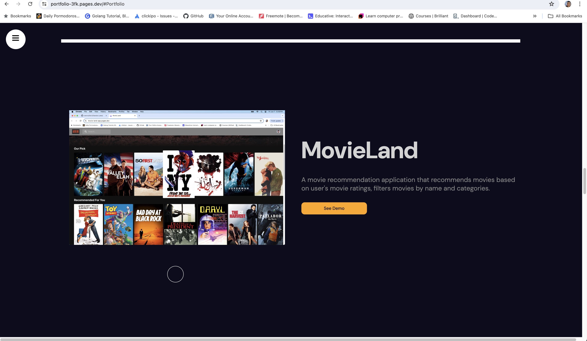
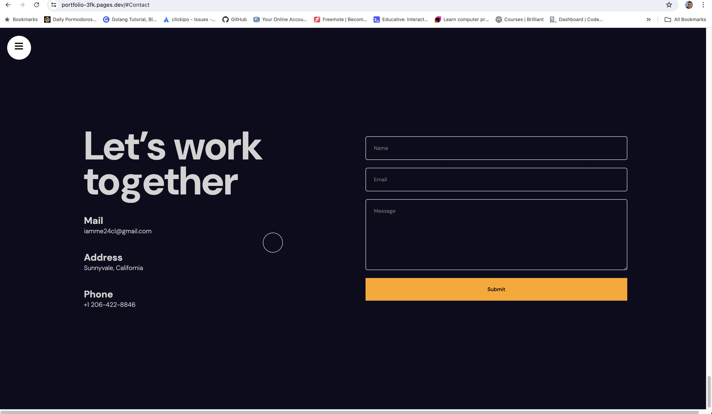

# Animated Portfolio Website

This project is a modern, animated portfolio website built using React, Vite, Framer Motion, and SASS. It showcases personal projects, skills, and experience with smooth and engaging animations.

## Table of Contents

- [Features](#features)
- [Demo](#demo)
- [Application Images](#application-images)
- [License](#license)

## Features

- **Animated Components**: Smooth animations using Framer Motion.
- **Responsive Design**: Optimized for both desktop and mobile devices.
- **Modern Stack**: Built with React and Vite for fast development.
- **SASS Styling**: Modular and reusable styling with SASS.

## Demo

Check out the live demo of the portfolio website [here](https://portfolio-3fk.pages.dev).

## Website Images

Include screenshots or images of your application to give users a visual representation of what to expect.

### Home Page

### Projects Section

### Contact Section

## License

This project is licensed under the MIT License. See the [LICENSE](LICENSE) file for more information.

### Contact Information
Feel free to reach out.

**Chandra Lama**  
Email: iamme24cl@gmail.com  
GitHub: [chandralama](https://github.com/chandralama)
